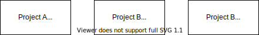
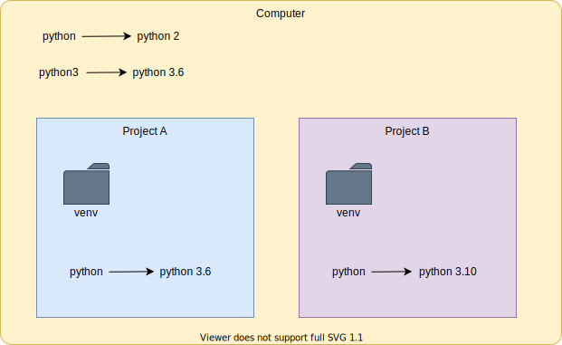

# Python Introduction

> NOTE: the following assumes you are running on a unix-esque terminal. If you are windows, either use WSL2 Ubuntu, or Git Bash.

## Check Your Version

Which version of Python do you have?

```
python --version
```

Most systems have Python 2 installed by default. You may _also_ have Python 3 installed, but it might be named `python3`:

```
python3 --version
```

**Alternately** you might have Python named `python2`:

```
python2 --version
```

## Download Python 3 (if you need it)

https://www.python.org/downloads/

If you are on a mac, you can also run:

```
brew install python
```

## Virtual Environments

You might have different projects that rely on different Python versions:



You can install python packages with a tool called `pip` (which might be `pip3` on your machine).

By default `pip` will install all of your packages into the same directory on your computer, using whatever the current Python version is.

This can, in some cases, cause issues that will slow down your development. So it's customary to create _virtual environments_ using `virtualenv`.

A `virtualenv` is a folder that contains:

- a specific python executable
- all packages you installed with `pip`

### Install Virtualenv

> NOTE: make sure you are in Python 3 for all of these examples.

```
pip3 install virtualenv
# or maybe...
# pip install virtualenv
```

### Create a Project Folder

```
mkdir example
cd example
```

### Create a Virtual Environment

```
virtualenv venv
```

This creates a folder named `venv` that has files like this:

```
venv
├── bin
│   ├── activate
│   ├── activate.csh
│   ├── activate.fish
│   ├── activate.nu
│   ├── activate.ps1
│   ├── activate_this.py
│   ├── deactivate.nu
│   ├── pip
│   ├── pip-3.9
│   ├── pip3
│   ├── pip3.9
│   ├── python -> /usr/local/opt/python@3.9/bin/python3.9
│   ├── python3 -> python
│   ├── python3.9 -> python
│   ├── wheel
│   ├── wheel-3.9
│   ├── wheel3
│   └── wheel3.9
├── lib
│   └── python3.9
└── pyvenv.cfg
```

It basically installed a new version of Python inside your project folder.

You'll always want to add `venv` to `.gitignore`, which you can do like this:

```
echo venv >> .gitignore
```

Now that it's installed, how do you use it?

### Activate the environment

You can tell your terminal to use this `venv` version of Python like so:

```
source venv/bin/activate
```

You'll know that your terminal window is activated when you see `(venv)` in your terminal prompt:

```
(venv) ➜  example git:(main) ✗ 
```

Did it work? Run `which python` and you'll notice that it points to the Python version in your `venv` folder:

```
which python
# /Users/you/example/venv/bin/python
which pip
/Users/you/example/venv/bin/pip
```

### Pythons Everywhere!!

Your computer may have or more Python versions installed:

1. Python 2 (either `python` or `python2`)
1. Python 3 (either `python` or `python3`)

Your computer also has `pip` installed (for example `pip`, `pip2` or `pip3`).

Once you **activate** a `virtualenv` you get standard naming:

1. `python` always points to the correct python version for the project
1. `pip` always points to the correct python version for the project



## Hello World

Every time you create a python script, you are creating a `module`.  Let's create one:

```
echo "print('Hello World')" > hello.py
```

And run the file:

```
python -m hello
```

What does the `-m` flag do? According to `python --help` it allows you to:

> run library module as a script

So it:

1. finds the module (aka file) named `hello.py`
1. executes the code from top to bottom

### Add `__pycache__` to gitignore

When you run a python script with `-m` it creates a folder named `__pycache__` so let's add that to `.gitignore`:

```
echo __pycache__ >> .gitignore
```

## Importing

You can import an entire other package like this:

```
import os
```

You can also import individual parts of a package like so:

```
from os import getenv
```

To demonstrate, run the following examples:

First, create a new file called `print-env-1.py` like so:

```
cat <<EOF > print-env-1.py
from os import environ

print(environ)
EOF
```

And run it like so:

```
python -m print-env-1.py
```

You should see your shell's environment variables printed on the screen.

Next, create a file called `print-env-2.py` like so:

```
cat <<EOF > print-env-2.py
import os

print(os.environ)
EOF
```

And run it like so:

```
python -m print-env-2.py
```

## Installing Packages

There are a few ways to manage dependencies in your application:

First, you can manually install packages with `pip install <package>`. This is the worst option as it means that every developer has to manually download each package on their own machine and manually ensure the versions are correct.

Next, you can put your requirements in a `requirements.txt` file and install it like so:

```
pip install -r requirements.txt
```

Finally (and best) you can use a [`Pipfile`](https://github.com/pypa/pipfile). That's what we'll be doing here.

### Install `pipenv`

> NOTE: you'll do this from _within_ your activated `virtualenv`

https://pipenv.pypa.io/en/stable/

```
pip install pipenv
```

### Install a package with pipenv

You can install packages using `pip`, but if you instead use `pipenv` you get some extra benefits.

To install a library run:

```
pipenv install requests
```

What just happened? `pipenv` did the following:

1. created file named `Pipfile` that has the following contents:

    ```
    [[source]]
    url = "https://pypi.org/simple"
    verify_ssl = true
    name = "pypi"

    [packages]
    requests = "*"

    [dev-packages]

    [requires]
    python_version = "3.9"
    ```

1. Downloaded the `requests` package to your `venv` folder

1. created a file named `Pipfile.lock` which contains a list of all the sub-dependencies of `requests` and their exact versions

