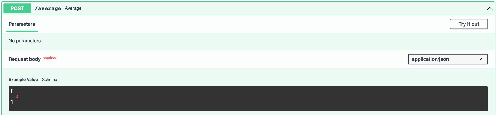

## FastAPI - POSTing simple JSON lists

Imagine you want to allow users to POST a JSON array of numbers, and return the average of the list. For example:

Input:

```json
[1,3,5,7]
```

Output:

```json
{
    "average": 4
}
```

Your first thought might be something like this:

```py
@app.post("/average")
def average(numbers):
    return {"average": round(sum(numbers)/len(numbers), 2)}
```

The problem here is that FastAPI will think that `list` is a query parameter, and furthermore it will think it's a string:


So you could add this:

```py
@app.post("/average")
def average(numbers: list):
    return {"average": round(sum(numbers)/len(numbers), 2)}
```

Better, but now it thinks you'll be posting a list of strings:


So you need to use Generics to tell FastAPI that it's a list of ints:

```py
@app.post("/average")
def average(numbers: list[int]):
    return {"average": round(sum(numbers)/len(numbers), 2)}
```




> TODO: as an extra challenge, take a moment and fix the divide by zero error that occurs when you send in an empty list `[]`

FastAPI has a great article about [Python Type Hints](https://fastapi.tiangolo.com/python-types/#type-hints-in-fastapi)
