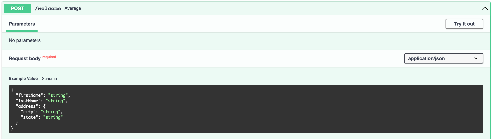

## FastAPI - POSTing JSON Objects

In real life, you'll need need to parse more complex objects. The way to do that in FastAPI is via [Pydantic Models](https://pydantic-docs.helpmanual.io/).

For example, let's say we wanted to POST this object to our API:

```json
{
    "firstName": "Some",
    "lastName": "User",
    "address": {
        "city": "New York",
        "state": "NY"
    }
}
```

First, import `BaseModel` from `pydantic`:

```py
from pydantic import BaseModel
```

Next, declare your types:

```py
class Address(BaseModel):
    city: str
    state: str


class Person(BaseModel):
    firstName: str
    lastName: str
    address: Address
```

Finally, build your endpoint:

```py
@app.post("/welcome")
def average(person: Person):
    return {"greeting": f"Hello {person.firstName} {person.lastName}! How's {person.address.city}?"}
```

The API docs now give great documentation:



And if you post this JSON body:

```json
{
  "firstName": "Example",
  "lastName": "User",
  "address": {
    "city": "New York",
    "state": "NY"
  }
}
```

Then you should see:

```json
{
  "greeting": "Hello Example User! How's New York?"
}
```

FastAPI parses the JSON, and creates python objects for you that match the schema you defined in the Pydantic model!


### Camel vs Snake Case

Camel case has no spaces, and capitalizes the first letter of every word, like `firstName`.

Snake case separates words by underscores, and does not capitalize anything, like `first_name`.

Python uses snake case. JSON typically uses camel case. So... how do you choose?

You don't have to! Here's an excellent article on how to get the best of both worlds:

https://medium.com/analytics-vidhya/camel-case-models-with-fast-api-and-pydantic-5a8acb6c0eee

## Full Example App

Here's a full example application:

```py
from fastapi import FastAPI
from pydantic import BaseModel

class Address(BaseModel):
    city: str
    state: str


class Person(BaseModel):
    firstName: str
    lastName: str
    address: Address


app = FastAPI()


@app.get("/")
def home():
    return {"Hello": "WORLD!!"}


@app.get("/double/{number}")
def double(number: int):
    return {"number": number, "doubled": number * 2}


@app.post("/average")
def average(numbers: list[int]):
    return {"average": round(sum(numbers)/len(numbers), 2)}


@app.post("/welcome")
def average(person: Person):
    return {"greeting": f"Hello {person.firstName} {person.lastName}! How's {person.address.city}?"}
```
