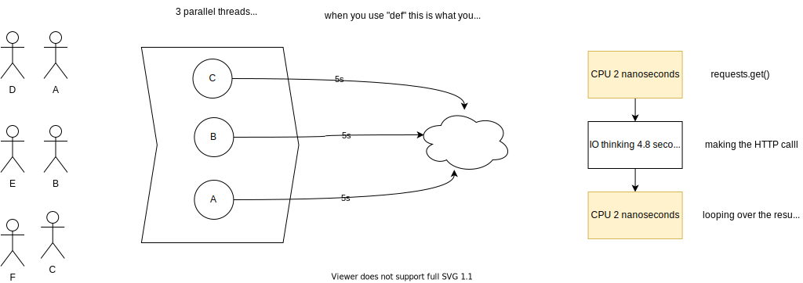
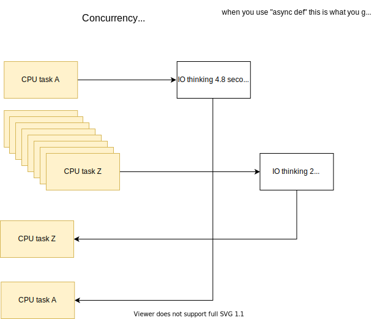

# Concurrency

Definitely read this article first: https://fastapi.tiangolo.com/async/?h=concurrency

There are two concepts you have to know in order to create the most cost efficient FastAPI applications:

- Parallelism
- Concurrency

### Processing in serial

If FastAPI + uvicorn ran things in serial it would be super slow/expensive to run:

If 2 users made a request at the same time, the second user would have to wait for the first user's request to finish


### Processing in parallel

One step better than running things in serial is to run things in parallel:



When you handle requests in parallel the number of requests you can handle is defined by how many parallel processes there are.

For example, if you have 3 processes running, you could serve responses to 3 users at the exact same time.

BUT - each process could still only handle one request at a time.

### Processing concurrently

Most modern web applications are IO bound. That means that most of the time is spent waiting for IO operations like reading from databases, calling HTTP services etc...

When the computer is transferring bytes across a network, it doesn't require a lot of CPU. But the CPU is "blocked" until the IO operation is done.

When running code concurrently, one process can serve requests to multiple users at the same time:



## def vs async def

There are two ways to define functions in FastAPI.

The first is to use the normal python `def`:

```py
@app.get("/")
async def change_me():
    content = {"msg": "change me"}
    headers = {"X-azure-management-service-CORRELATION-ID": str(uuid4()), "x-azure-management-service-server": "azure-management-service-prototype"}
    return JSONResponse(content=content, headers=headers)  

```

The other way is to use `async def`

```py
@app.get("/")
async def change_me():
    content = {"msg": "change me"}
    headers = {"X-azure-management-service-CORRELATION-ID": str(uuid4()), "x-azure-management-service-server": "azure-management-service-prototype"}
    return JSONResponse(content=content, headers=headers)  

```

So when do you use each?

### Methods defined with `async def` run in concurrently

Use `async def` whenever:

- you have the word `await` in your function
- you are doing "normal" data processing

Many (if not most) of the methods in your FastAPI app will be `async def`

### Methods defined with `def` run (just) in parallel

Use `def` when you have:

- extremely CPU intense tasks (this is rare outside of machine learning or cryptography contexts)
- blocking IO calls, such as `requests.get`

## Async libraries

https://www.python-httpx.org/async/