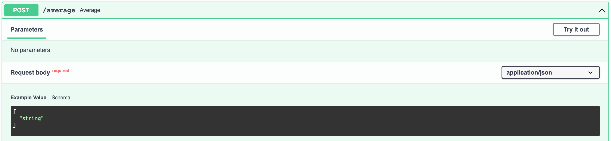

# FastAPI

> NOTE: you can create a FastAPI app for AA within runway by choosing "Create and App" > "PythonFastAPI"

## Create an empty python project

```
mkdir ~/fastapi-basics
cd ~/fastapi-basics

# mac
virtualenv venv
source venv/bin/activate

# windows in Git Bash
python -m virtualenv venv
source venv/Scripts/activate

pip install pipenv
```

## Install FastAPI

```
pipenv install fastapi
pipenv install "uvicorn[standard]"
```

## Add a simple GET endpoint

Create a file named `main.py` with the following contents:

```python
from fastapi import FastAPI

app = FastAPI()


@app.get("/")
def home():
    return {"Hello": "World"}
```

## Run the app

```
uvicorn main:app --reload
```

Visit http://localhost:8000/ and you should see:

```
{"Hello": "World"}
```

## Hot reloading

Since you specified the `--reload` option when you started the server, any changes you make to your application will be immediately reflected.

Change the app file to return a different result, like so:

```python
from fastapi import FastAPI

app = FastAPI()


@app.get("/")
def home():
    return {"Hello": "WORLD!!!!"}
```

Go back to your browser and refresh the page. You should see the updated version: `{"Hello": "WORLD!!!!"}`

> NOTE: you do _not_ want to turn this on in production

## Live Documentation

Visit http://localhost:8000/docs - it's like magic! It uses Swagger to auto-generate API documentation for you.

Follow these steps to actually make a request:


---

---

---


## Specifying Path Parameters

```python
@app.get("/double/{number}")
def double(number):
    return {"number": number, "doubled": number * 2}
```

Now try accessing that endpoint with a few different URLs:

- http://localhost:8000/double/4
- http://localhost:8000/double/5
- http://localhost:8000/double/6

### Adding Types

Hrm... something doesn't look right 🤔

When you request http://localhost:8000/double/6 it returns the following:

```json
{
    "number": "6",
    "doubled": "66"
}
```

Instead of multiplying the number `6` by 2, it just _string concatenates_ the string `"6"`.

The way to fix that is to add type hints:

```python
@app.get("/double/{number}")
def double(number: int):
    return {"number": number, "doubled": number * 2}
```

Now when you make the request, FastAPI knows to convert the `number` variable to an `int` for you, and you get:

```json
{
    "number": 6,
    "doubled": 12
}
```

FastAPI relies heavily on using types, as you'll see.

Try it out from the live docs as well!

http://localhost:8000/docs#/default/double_double__number__get

> NOTE: there's also another set of generated docs at http://127.0.0.1:8000/redoc

## Challenges for GET requests

First, create a new GET endpoint named `shout` that takes a string and returns a JSON object like with the uppercased string and an exclamation point. For example:

If you go to http://localhost:8000/shout/hello you should see:

```json
{
    "word": "hello", 
    "shout": "HELLO!"
}
```

Then, create a new GET endpoint named `opposite` that takes a boolean and returns a JSON object with the opposite of the value. For example:

If you go to http://localhost:8000/opposite/true you should see:

```json
{
    "value": true, 
    "opposite": false
}
```

> NOTE: you may have to Google how to uppercase a string, perform string concatenation, or use Python conditional statements (if statements).

## POSTing simple JSON lists

Imagine you want to allow users to POST a JSON array of numbers, and return the average of the list. For example:

Input:

```json
[1,3,5,7]
```

Output:

```json
{
    "average": 4
}
```

Your first thought might be something like this:

```py
@app.post("/average")
def average(numbers):
    return {"average": round(sum(numbers)/len(numbers), 2)}
```

The problem here is that FastAPI will think that `list` is a query parameter, and furthermore it will think it's a string:


So you could add this:

```py
@app.post("/average")
def average(numbers: list):
    return {"average": round(sum(numbers)/len(numbers), 2)}
```

Better, but now it thinks you'll be posting a list of strings:



So you need to use Generics to tell FastAPI that it's a list of ints:

```py
@app.post("/average")
def average(numbers: list[int]):
    return {"average": round(sum(numbers)/len(numbers), 2)}
```


> TODO: as an extra challenge, take a moment and fix the divide by zero error that occurs when you send in an empty list `[]`

FastAPI has a great article about [Python Type Hints](https://fastapi.tiangolo.com/python-types/#type-hints-in-fastapi)

## POSTing JSON Objects

In real life, you'll need need to parse more complex objects. The way to do that in FastAPI is via [Pydantic Models](https://pydantic-docs.helpmanual.io/).

For example, let's say we wanted to POST this object to our API:

```json
{
    "firstName": "Some",
    "lastName": "User",
    "address": {
        "city": "New York",
        "state": "NY"
    }
}
```

First, import `BaseModel` from `pydantic`:

```py
from pydantic import BaseModel
```

Next, declare your types:

```py
class Address(BaseModel):
    city: str
    state: str


class Person(BaseModel):
    firstName: str
    lastName: str
    address: Address
```

Finally, build your endpoint:

```py
@app.post("/welcome")
def average(person: Person):
    return {"greeting": f"Hello {person.firstName} {person.lastName}! How's {person.address.city}?"}
```

The API docs now give great documentation:


And if you post this JSON body:

```json
{
  "firstName": "Example",
  "lastName": "User",
  "address": {
    "city": "New York",
    "state": "NY"
  }
}
```

Then you should see:

```json
{
  "greeting": "Hello Example User! How's New York?"
}
```

FastAPI parses the JSON, and creates python objects for you that match the schema you defined in the Pydantic model!


### Camel vs Snake Case

Camel case has no spaces, and capitalizes the first letter of every word, like `firstName`.

Snake case separates words by underscores, and does not capitalize anything, like `first_name`.

Python uses snake case. JSON typically uses camel case. So... how do you choose?

You don't have to! Here's an excellent article on how to get the best of both worlds:

https://medium.com/analytics-vidhya/camel-case-models-with-fast-api-and-pydantic-5a8acb6c0eee

## Full Example App

Here's a full example application:

```py
from fastapi import FastAPI
from pydantic import BaseModel

class Address(BaseModel):
    city: str
    state: str


class Person(BaseModel):
    firstName: str
    lastName: str
    address: Address


app = FastAPI()


@app.get("/")
def home():
    return {"Hello": "WORLD!!"}


@app.get("/double/{number}")
def double(number: int):
    return {"number": number, "doubled": number * 2}


@app.post("/average")
def average(numbers: list[int]):
    return {"average": round(sum(numbers)/len(numbers), 2)}


@app.post("/welcome")
def average(person: Person):
    return {"greeting": f"Hello {person.firstName} {person.lastName}! How's {person.address.city}?"}
```
